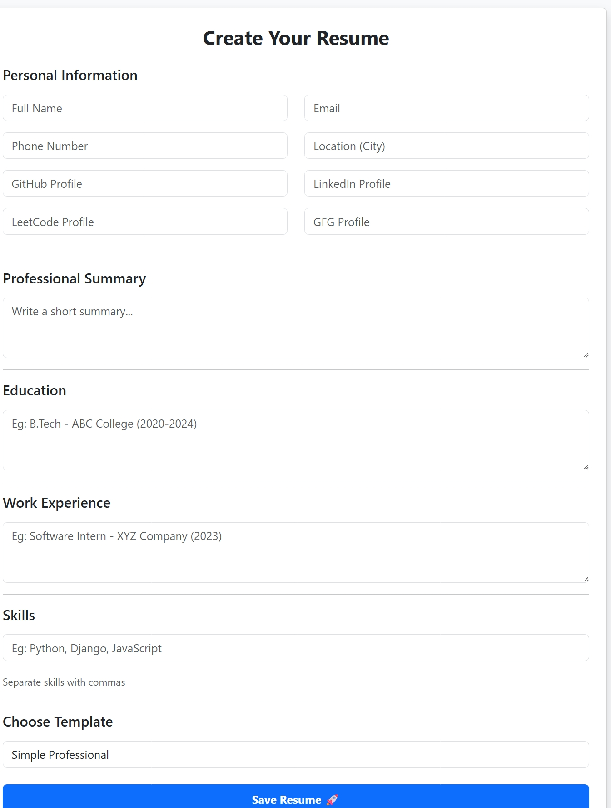
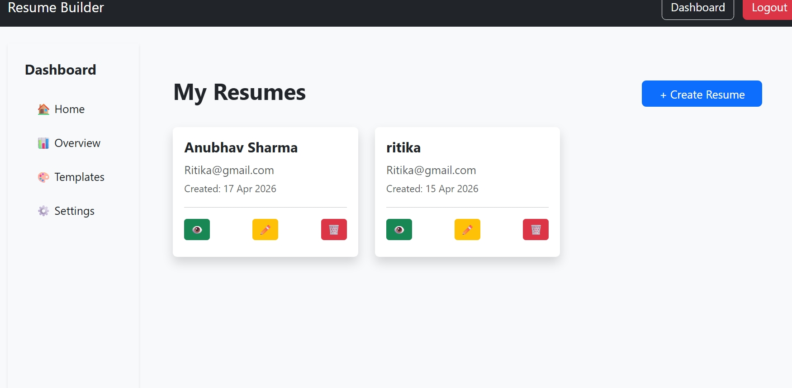
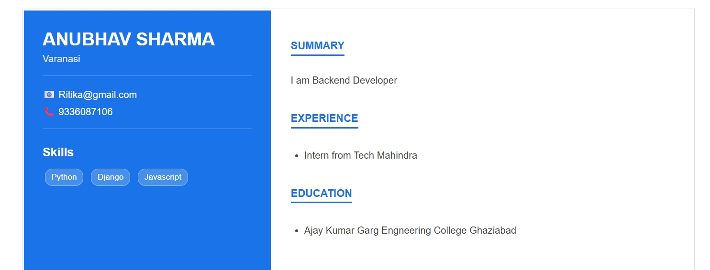
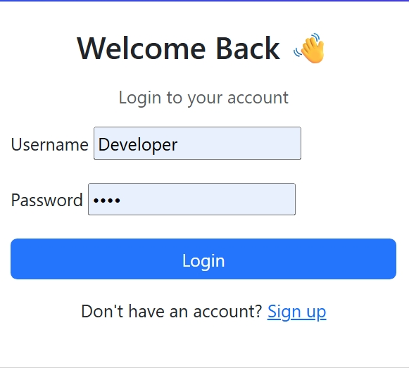
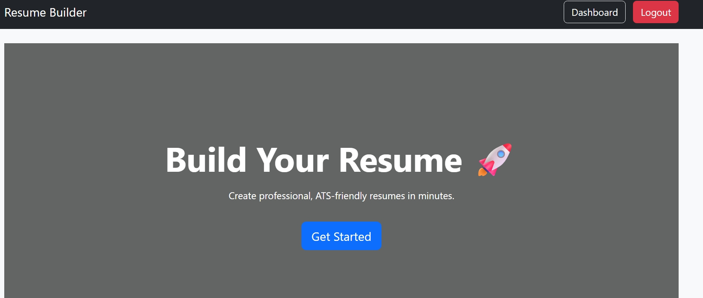
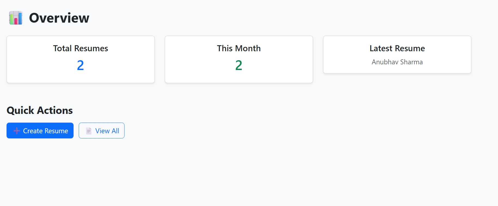
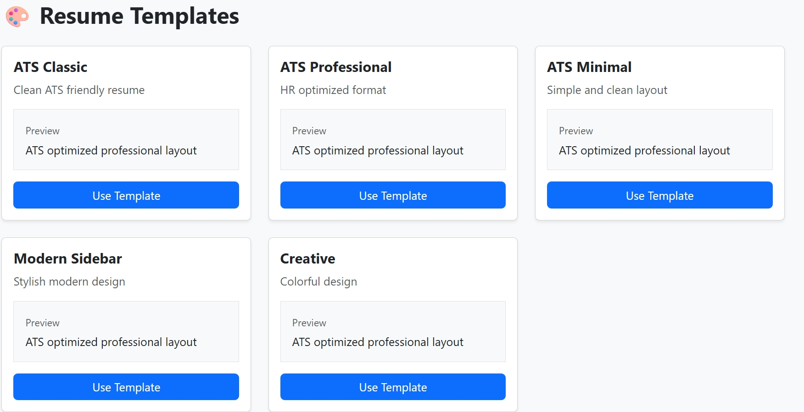
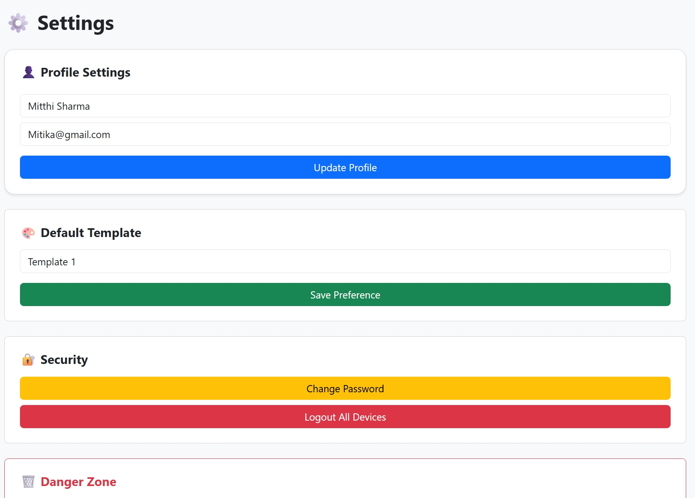

# Resume Builder Web Application

A full-stack Resume Builder web application developed using Django that allows users to create, manage, and download professional resumes easily.

---

## 🚀 Features
- Create and manage multiple resumes  
- Edit and delete resumes  
- Preview resume before downloading  
- Download resumes as PDF  
- User authentication (Signup, Login, Logout)  
- Password management and account deletion  
- Dashboard to manage all resumes  

---

## 🛠️ Tech Stack
- Backend: Django, Python  
- Frontend: HTML, CSS, Bootstrap  
- Database: SQLite  
- PDF Generation: Python libraries  

---

## 📸 Screenshots

### Resume Form

### Dashboard

### Generated Resume

### Login Page

### Home Page

 ### Overview Page

 ### Templates Page

 ### Setting Page

---

## ⚙️ How to Run
1. Clone the repository  
2. Navigate to project folder  
3. Install dependencies: